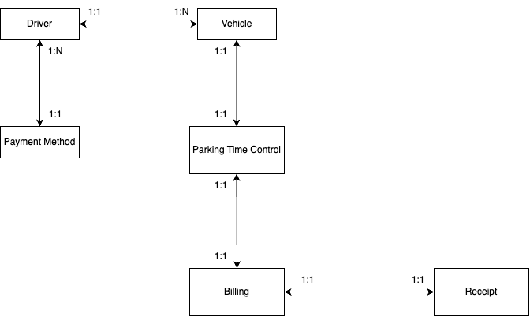

# Parking Meter :car: :bar_chart:
**Tech Challenge - Phase 3 - Graduate/Pós-Graduação**

* GitHub Repository: https://github.com/igorgrv/parkingmeter-graduate
* Swagger: http://localhost:8080/swagger-ui/index.html
    * https://parkingmeter-e2kw5mlx.b4a.run/swagger-ui/index.html

## About :book:

Welcome to Parking Meter Monitor! An innovative project that combines the powerful technologies of:

* Java 17;
* MongoDB;
* Maven; 
* Spring Boot;
* Spring Validation;
* Spring Scheduler;
* Lombok;

## Working with MongoDB

To get started you need to:
* Install MongoDB Community Server: https://www.mongodb.com/try/download/community
* After that, execute in a terminal:  **`mongosh`**
* With the server up and running, execute the following commands:

```bash
use parking-meter
```


### Basic MongoDB Commands

|           **MongoDB Command**            | **Description**                                     |
|:----------------------------------------:|:----------------------------------------------------|
|      **`mongod`** or **`mongosh`**       | Starts mongoDB Server                               |
|           **`show databases`**           | Show all the databases                              |
|          **`use databaseName`**          | Select the Database                                 |
|          **`show collections`**          | Show all the collections for the specific database  |
|       **`db.collectName.drop()`**        | Drop the specified collection                       |
| **`db.nomeCollection.countDocuments()`** | Count the documents given a collection              |
|      **`db.nomeCollection.find()`**      | Shows all the documents of the specified collection |


## Entity-relationship




## AWS Architecture


### AWS Account and Resources

|                     |                                                    |
|:-------------------:|:---------------------------------------------------|
|   **`Login URL`**   | https://850055427903.signin.aws.amazon.com/console |
|     **`User`**      | fiap-professor                                     |
|   **`Password`**    | Check PDF                                          |
| **`Access Policy`** | ReadOnlyAccess                                     |
|    **`Region`**     | North Virginia                                     |


|           **Service**           | **Resource Name**          | "ARN / Description"                                                                               |
|:-------------------------------:|:---------------------------|---------------------------------------------------------------------------------------------------|
|         **`CodeBuild`**         | parking-meter-codebuild    | parking-meter-codebuild:ae5ee75b-f1c9-46d9-98fb-35a81571015b                                      |
|            **`ECR`**            | parking-meter              | 850055427903.dkr.ecr.us-east-1.amazonaws.com/parking-meter                                        |
|       **`Target Group`**        | parking-meter-tg           | arn:aws:elasticloadbalancing:us-east-1:850055427903:targetgroup/parking-meter-tg/e85cab6527f17c55 |
|       **`Load Balancer`**       | parking-meter-lb           | parking-meter-lb-791359489.us-east-1.elb.amazonaws.com                                            |
|      **`Security Group`**       | parking-meter-sg           | ID sg-0e03a6b12d11282c3                                                                           |
|          **`Cluster`**          | cluster-parking-meter      | arn:aws:ecs:us-east-1:850055427903:cluster/cluster-parking-meter                                  |
| **`Task Definition - Fargate`** | parking-meter-task         | arn:aws:ecs:us-east-1:850055427903:task-definition/parking-meter-task:1                           |
|       **`CodePipeline`**        | parking-meter-codepipeline | ID pipeline:4106e63e-5621-4f0b-ae41-77b317a70181                                                  |
|          **`Service`**          | parking-meter-service      | We deleted the service because we set up a task like Fargate which is subject to charges          |


### Service Auto Scaling


In this configuration we can change the metric for CPU or Memory, and the maximum number of instances/tasks that we can scale. This way, CloudWatch will alert the AWS Auto Scaling service to scale our application when the CPU average is 80%.


## Back4App Containers
To test remotely We perform the deployment on back4app.
Swagger: https://parkingmeter-e2kw5mlx.b4a.run/swagger-ui/index.html


## Challenges

* Finding best practices for a noSql project
* Work with NoSQL databases
* Creating a AWS infrastructure from the beginning
